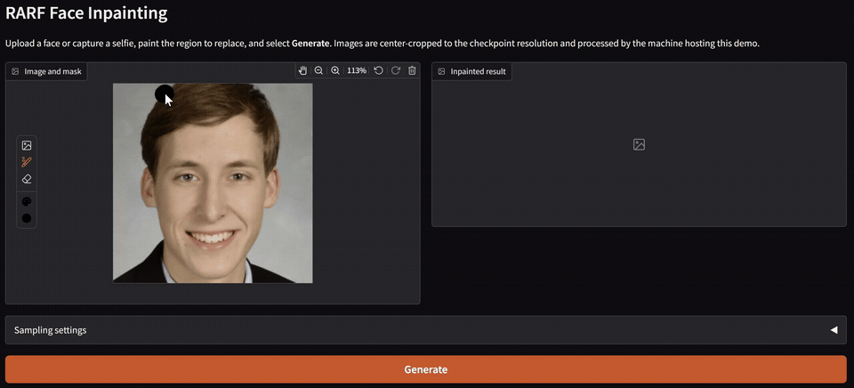

# RARF: Region-Aware Rectified Flows

This repository contains a task-agnostic implementation of **Region-Aware Rectified Flows**.
The repository separates the generative method from the specific application to the [BraTS 2026 inpainting challenge](https://www.synapse.org/Synapse:syn74274097/wiki/639571) submission, which was the original use-case for the method.

## Design

Any application of the method communicates with the
generic training module through a small batch dictionary:

```python
{
    "target": target,                  # required: [B, C, *spatial]
    "mask": missing_region,            # optional
    "loss_mask": scored_region,        # optional
    "recon_loss_mask": scored_region,  # optional
}
```

## Configurable RARF modes

RARF behavior is controlled by two independent choices:

1. the flow path used during training;
2. how time and region information are provided to the U-Net.

### Flow path

`path_mode` selects the rectified-flow path:

* **`inpaint`**
  Generates only inside the supplied missing region. The visible context remains fixed throughout the flow.

* **`two_phase`**
  Uses RAD-style regional ordering along a single global flow path. The context region is generated first, followed by the missing region.

* **`unconditional`**
  Applies ordinary rectified flow to the complete sample without regional constraints.

### Time conditioning

`conditioning_mode` determines how progress along the flow is represented:

* **`scalar`**
  Uses one timestep value per sample.

* **`spatial`**
  Uses a voxel-wise time map, embedded throughout the U-Net. This is required by `path_mode: two_phase`.

### Additional options

* **`mask_conditioning`**: when enabled, the binary mask is concatenated as an explicit input channel.
* **`time_sampling`**:

  * `uniform` samples time uniformly;
  * `mixed` uses clean-biased sampling mixture.
* **`phase_boundary`**: a value in `(0, 1)` defining when `two_phase` switches from context generation to missing-region generation.

### Initial challenge configuration

The original challenge setup uses masked inpainting with scalar time conditioning:

```yaml
model:
  path_mode: inpaint
  conditioning_mode: scalar
  mask_conditioning: true
  time_sampling: mixed
```

### General region-aware configuration

The full region-aware setup uses spatial conditioning and RAD-style two-phase ordering:

```yaml
model:
  path_mode: two_phase
  conditioning_mode: spatial
  mask_conditioning: false
  time_sampling: uniform
  phase_boundary: 0.5
```


## Installation

Install the core method and training module in editable mode:

```bash
pip install -e .
```

Install the corresponding optional dependencies for the included pipelines:

```bash
pip install -e ".[images]"  # FFHQ
pip install -e ".[brats]"  # BraTS
```

## Training pipelines

The repository includes two ready-to-use training pipelines demonstrating how RARF can be applied to different domains. Adapting the framework to another dataset mainly requires implementing the corresponding Lightning `DataModule` and, when needed, a task-specific `LightningModule`.

### FFHQ

The [FFHQ pipeline](rarf/train_images.py) demonstrates 2D natural-image inpainting. Images can be loaded directly from Hugging Face or from a local directory.

```bash
python rarf/train_images.py fit \
  -c configs/ffhq/two_phase.yaml
```

### BraTS

The [BraTS pipeline](brats) demonstrates 3D medical-image inpainting and includes several training configurations.

```bash
python brats/train.py fit \
  -c configs/brats/two_phase.yaml \
  --data.data_dir /path/to/train_cases \
  --data.train_split 0.95
```

## Demo

<p align="center">
  
</p>

<p align="center">
  <sub>
    Demo photograph:
    <a href="https://www.flickr.com/photos/phideltatheta/32387477985/">Nikolai Michigan</a>
    by pdtghq, licensed under
    <a href="https://creativecommons.org/licenses/by/2.0/">CC BY 2.0</a>.
    The FFHQ-aligned crop is displayed at 256&times;256; the animation adds the
    painted mask and generated result.
  </sub>
</p>

The interactive face-inpainting demo loads a natural-image checkpoint once,
lets the user paint a mask directly over an uploaded image, and performs
single-sample inference with a configurable random seed. The sample image at [assets/demo/face.png](./assets/demo/face.png)
was obtained from [`merkol/ffhq-256`](https://huggingface.co/datasets/merkol/ffhq-256).

```bash
pip install -e ".[demo]"
python demo/face_inpainting.py --checkpoint /path/to/ffhq.ckpt
```

Open `http://127.0.0.1:7860`, upload a face, capture a webcam selfie, or use the
included FFHQ training example. Paint the region to replace and select
**Generate**. Images are center-cropped to the resolution stored in the
checkpoint. Webcam access requires browser permission. Captured images
are processed by the machine hosting the demo.

## Inference and Docker submission

The BraTS package provides local single-case inference and a minimal,
checkpoint-contained Docker submission image. See the
[BraTS inference and Docker documentation](brats/README.md#docker-submission)
for the expected challenge layout, build instructions, runtime options, and
output validation.

## Checkpoints

The pretrained BraTS checkpoint is available on
[Hugging Face](https://huggingface.co/TomasGuija/rarf-brats). You can
[download `rarf-brats.ckpt` directly](https://huggingface.co/TomasGuija/rarf-brats/resolve/main/rarf-brats.ckpt)
or use the Hugging Face CLI:

```bash
hf download TomasGuija/rarf-brats rarf-brats.ckpt \
  --local-dir checkpoints/rarf-brats
```

The training configurations currently enable exponential moving average (EMA)
through `RARFModule`. EMA is implemented manually because the repository uses
Lightning 2.5.5, which predates the `EMAWeightAveraging` callback introduced in
Lightning 2.6. The current checkpoint format stores trainable weights in
`state_dict` and averaged model weights separately in `ema_state_dict`.

A future release should prefer Lightning's `EMAWeightAveraging` callback and
configure it through the training YAML files. That migration must explicitly
convert existing checkpoints.

## Citation

The citation for RARF is coming soon.

## License

The source code is available under the [MIT License](LICENSE). Third-party
datasets, checkpoints, and media remain subject to their respective licenses
and terms.

## References

1. Sora Kim, Sungho Suh, and Minsik Lee. **“RAD: Region-Aware Diffusion Models for Image Inpainting.”** *2025 IEEE/CVF Conference on Computer Vision and Pattern Recognition (CVPR)*, pp. 2439–2448, 2025. [doi:10.1109/CVPR52734.2025.00233](https://doi.org/10.1109/CVPR52734.2025.00233).

2. Xingchao Liu, Chengyue Gong, and Qiang Liu. **“Flow Straight and Fast: Learning to Generate and Transfer Data with Rectified Flow.”** *arXiv preprint arXiv:2209.03003*, 2022. [arXiv:2209.03003](https://arxiv.org/abs/2209.03003).

3. Ujjwal Baid, Satyam Ghodasara, Suyash Mohan, et al. **“The RSNA-ASNR-MICCAI BraTS 2021 Benchmark on Brain Tumor Segmentation and Radiogenomic Classification.”** *arXiv preprint arXiv:2107.02314*, 2021. [arXiv:2107.02314](https://arxiv.org/abs/2107.02314).

4. Florian Kofler, Felix Meissen, Felix Steinbauer, et al. **“The Brain Tumor Segmentation (BraTS) Challenge: Local Synthesis of Healthy Brain Tissue via Inpainting.”** *arXiv preprint arXiv:2305.08992*, 2024. [arXiv:2305.08992](https://arxiv.org/abs/2305.08992).

5. Tero Karras, Samuli Laine, and Timo Aila. **“A Style-Based Generator Architecture for Generative Adversarial Networks.”** *2019 IEEE/CVF Conference on Computer Vision and Pattern Recognition (CVPR)*, pp. 4401–4410, 2019. [CVF Open Access](https://openaccess.thecvf.com/content_CVPR_2019/html/Karras_A_Style-Based_Generator_Architecture_for_Generative_Adversarial_Networks_CVPR_2019_paper.html).
